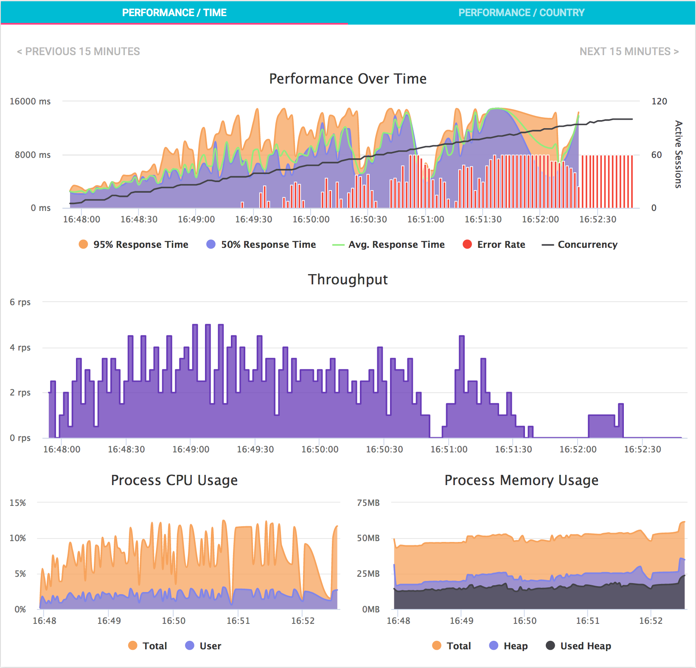

# Express Loadmill
Users of [Loadmill](https://www.loadmill.com) can use this express middleware for: 
1. Quick and easy [domain verification](https://docs.loadmill.com/setup/domain-verification).
2. Enabling CORS **strictly** from [loadmill.com](https://www.loadmill.com) in order to perform [crowdsourced load tests](https://docs.loadmill.com/setup/testing-with-cors).
3. Sample [performance metrics of the Node process](#monitoring) to be viewed alongside client-side metrics during a load test.

## Installation
Using npm:

`npm install express-loadmill --save`

Using yarn:

`yarn add express-loadmill`

## Usage
Use loadmill middleware before everything else (that should be exposed to testing):
```js
var app = require('express')();
var Loadmill = require('express-loadmill');

app.use(Loadmill({verifyToken: process.env.LOADMILL_VERIFY_TOKEN}));
```

The above code enables both CORS and domain verification. You may optionally disable CORS by setting the `enableCors` option to false, e.g.
```js
app.use(Loadmill({enableCors: false, verifyToken: process.env.LOADMILL_VERIFY_TOKEN}));
```
Note however that you will not be able to perform **high-volume load tests** with loadmill without enabling CORS.

Domain verification will only be enabled if you supply a verification token, thus the following code will only enable CORS:
```js
app.use(Loadmill());
```

## Cookies
To enable cookies being sent to and from the server (by setting `Access-Control-Allow-Credentials` response header), 
set the `enableCookies` option to `true`, e.g.
```js
app.use(Loadmill({enableCookies: true, verifyToken: process.env.LOADMILL_VERIFY_TOKEN}));
```
Note that you will also need to enable cookies for your test in the **Advanced Settings** section of your test configuration.

## Monitoring
By enabling performance monitoring, samples of CPU and memory usage of the Node process will be sent to Loadmill
(only during load testing) and will be displayed alongside client-side metrics in your performance metrics charts.



The monitoring module is an optional dependency, therefore **_you must install it._** Before installing, make sure you are using Node version **v6.1.0 or higher.**

Using npm:

`npm install express-loadmill loadmill-monitor --save`

Using yarn:

`yarn add express-loadmill loadmill-monitor`

To enable monitoring, you need to configure `monitor` options with a personal API token (note this is **_not_** the same as `verifyToken`):
```js
app.use(Loadmill({
    verifyToken: process.env.LOADMILL_VERIFY_TOKEN,

    monitor: {
        // Required:
        apiToken: process.env.LOADMILL_API_TOKEN,

        // Default is TRUE:
        enabled: process.env.ENABLE_LOADMILL_MONITORING
    }
}));
```

## Learn More
- About [Loadmill](https://www.loadmill.com)
- About [domain verification](https://docs.loadmill.com/setup/domain-verification)
- About [testing with CORS](https://docs.loadmill.com/setup/testing-with-cors)
